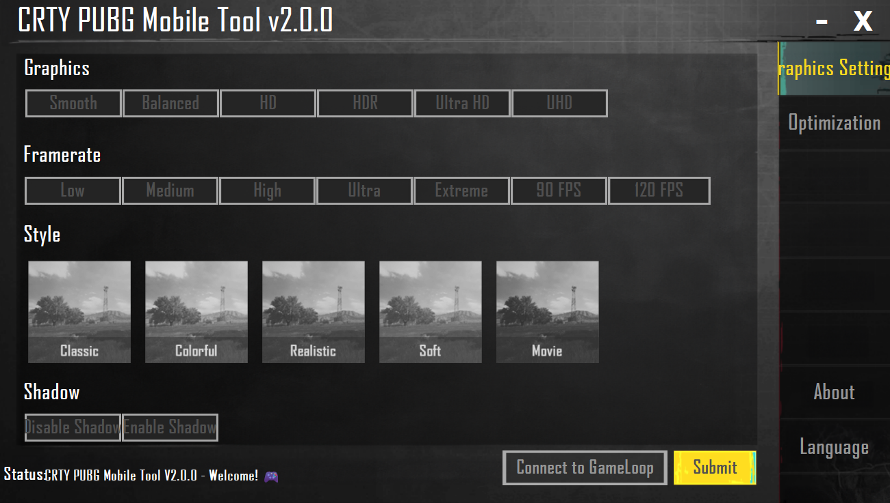
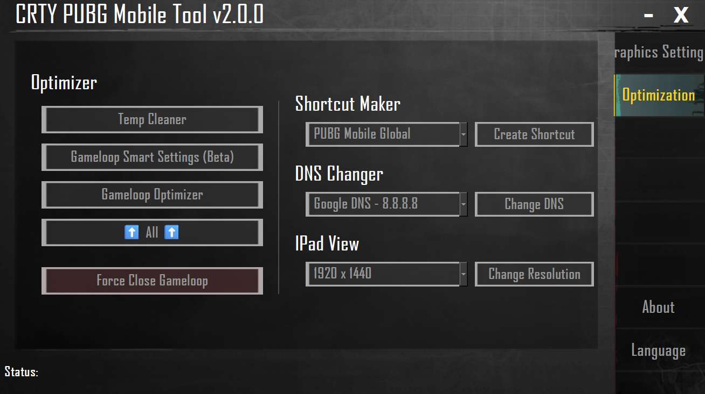
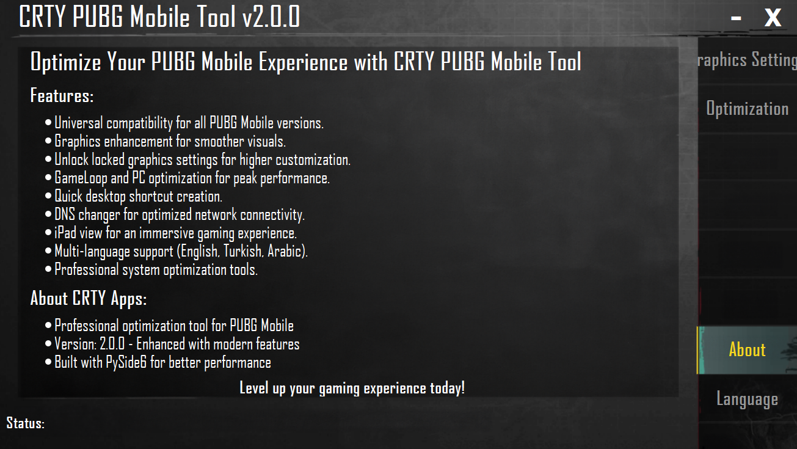

<div align="center">

<h1>CRTY PUBG Mobile Tool V2.0.0</h1>
🎮 Professional PUBG Mobile Optimization Tool for GameLoop<br><br>

[](https://github.com/CRTY/CRTY-PUBG-Mobile-Tool) [](https://github.com/CRTYPUBG) [](LICENSE) [](https://github.com/CRTYPUBG/CRTY-PUBG-Mobile-Tool)

**🆕 V2.0.0 NEW FEATURES:**
- 🎯 Enhanced GameLoop connection system
- 🚀 Improved performance and stability
- 🌍 Multi-language support (English, Turkish, Arabic)
- 🔧 Better error handling and user feedback
- 📱 Dedicated Language selection page
- ⚡ Optimized build system with PySide6

**🇺🇸 English** | [**العربية**](./README.ar.md) | [**🇹🇷 Türkçe**](./README.tr.md)

</div>

------
<br>
CRTY PUBG Mobile Tool V2.0.0 is a professional utility tool that enables you to optimize your PUBG Mobile gaming experience on GameLoop emulator on PC. This tool supports all versions of PUBG Mobile with modern animation system and enhanced user interface:

*   🌍 PUBG Mobile Global
*   🇻🇳 PUBG Mobile VN
*   🇹🇼 PUBG Mobile TW
*   🇰🇷 PUBG Mobile KR
*   🇮🇳 Battlegrounds Mobile India

🚀 Features
--------

### 🎨 PUBG Mobile Graphics Settings

With this option, you can change the graphics settings of PUBG Mobile on GameLoop. With animated interface, you have the following options:

**Graphics Quality:**
*   ✨ Smooth
*   ⚖️ Balanced
*   🔥 HD (High Definition)
*   💎 HDR (High Dynamic Range)
*   **🌟 Ultra HD (Highest Quality)**

**FPS Options:**
*   🐌 Low
*   📊 Medium
*   ⚡ High
*   🚀 Ultra
*   🔥 Extreme (60 FPS)
*   **⭐ Extreme+** (**90 FPS**)
*   **💫 Ultra Extreme** (**120 FPS**)

### ⚡ GameLoop & PC Optimization

This option allows you to optimize your GameLoop emulator and PC for better performance while playing PUBG Mobile. With animated feedback:

*   🧹 **Temp Cleaner** - Clean temporary files
*   🎯 **GameLoop Smart Settings** - Smart settings
*   🔧 **GameLoop Optimizer** - Advanced optimization
*   ❌ **Kill GameLoop Processes** - Terminate GameLoop processes

### 🔗 Create Desktop Shortcut

Create a desktop shortcut for PUBG Mobile for easier access to the game. With animated confirmation messages.

### 🌐 DNS Changer

Change your DNS settings effortlessly with the DNS Changer feature. Enjoy a better internet experience with just a few clicks. With ping indicator and animated status updates.

### 📱 iPad View

Change resolution settings to simulate an iPad-like display with one click and get game layout. With smooth transition animations.

📖 Usage
-----

There are 2 ways to run the tool:

### 1️⃣ Download and Run
To use this tool, simply download the app from the [releases page (Download)](https://github.com/CRTYPUBG/CRTY-PUBG-Mobile-Tool/releases) and run it on your PC. Follow the on-screen instructions to change graphics settings, optimize GameLoop and PC, or create a desktop shortcut for PUBG Mobile.

##### 🎯 How to use the tool [Wiki page (Click Here)](https://github.com/CRTYPUBG/CRTY-PUBG-Mobile-Tool/wiki)

### 2️⃣ Python Execution
Download the source code, then install the necessary dependencies to run it:
```shell
pip install -r requirements.txt
```
After the installation is complete, run the tool:
```shell
python main.py
```

### 🆕 V2.0.0 New Animation Features:
- ✨ **Startup Animations** - Smooth fade-in effects on application startup
- 🎯 **Button Animations** - Bounce effects on every button click
- 🔄 **Page Transition Animations** - Smooth transitions between pages
- 📊 **Status Animations** - Loading, success and error animations
- 🎨 **Visual Effects** - Pulse, shake and fade effects

📸 Screenshots
-----------

Screenshots of CRTY PUBG Mobile Tool V2.0.0:





### 🎬 V2.0.0 Animation Preview:
- 🌟 Modern interface design
- ✨ Smooth animation transitions
- 🎯 Interactive button effects
- 📱 Responsive design

⚠️ Important Notes
----

- This tool is not affiliated with PUBG Mobile or GameLoop
- Use at your own risk
- The new animation system in V2.0.0 provides better performance
- All operations are designed to be safe and reversible

### 🔧 System Requirements:
- Windows 10/11
- Python 3.8+ (for running from source code)
- GameLoop Emulator
- 4GB RAM (recommended)

### 📞 Support:
- 🐛 Bug reports: [Issues](https://github.com/CRTYPUBG/CRTY-PUBG-Mobile-Tool/issues)
- 💬 Community support: [Discussions](https://github.com/CRTYPUBG/CRTY-PUBG-Mobile-Tool/discussions)
- 📧 Contact: crty@example.com

---
<div align="center">

**⭐ Don't forget to star if you liked it!**

Made with ❤️ by CRTY Team

</div>
